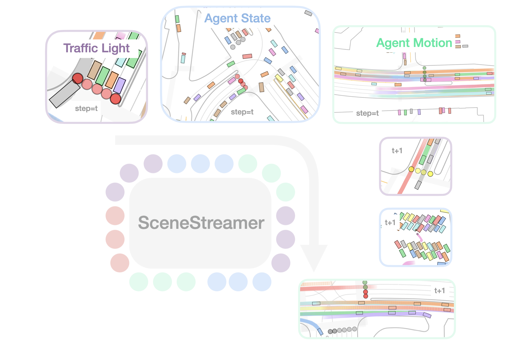

# SceneStreamer: Continuous Scenario Generation as Next Token Group Prediction


<h3>Zhenghao Peng, Yuxin Liu, Bolei Zhou</h3>


<h3>ICLR 2026</h3>


[**Paper**](https://arxiv.org/pdf/2506.23316v2) | [**Webpage**](https://vail-ucla.github.io/scenestreamer/) | [**Code**](#) | [**Live Demo**](https://huggingface.co/spaces/pengzhenghao97/SceneStreamer)


<p align="center">
  
</p>


**SceneStreamer** is a unified autoregressive model for realistic traffic scenario generation in autonomous driving simulation. It supports motion prediction for existing agents and densification via dynamic agent injection.


## 🚀 Quick Start

### Installation with UV (Recommended)

[UV](https://github.com/astral-sh/uv) is a fast Python package manager. Install it first:

```bash
# Install uv
curl -LsSf https://astral.sh/uv/install.sh | sh
```

Then set up the project:

```bash
# Clone repository
git clone https://github.com/pengzhenghao/scenestreamer.git
cd scenestreamer

# Create virtual environment and sync dependencies (requires Python 3.10 or 3.11)
uv sync --python 3.11
source .venv/bin/activate  # On Windows: .venv\Scripts\activate

# Launch the quick interactive demo
# See: https://huggingface.co/spaces/pengzhenghao97/SceneStreamer
uv run python scripts/demo_gradio.py
```

## 💡 Usage Examples

Run the example scripts directly:

```bash
uv run python example_scenestreamer_motion_only.py --hf-file scenestreamer-base-large.ckpt
uv run python example_scenestreamer_motion_and_densified_agents.py --hf-file scenestreamer-full-large.ckpt
```

Run the browser demo directly as in [HuggingFace Spaces](https://huggingface.co/spaces/pengzhenghao97/SceneStreamer):

```bash
uv sync
uv run python scripts/demo_gradio.py
```

You do **not** need to convert Waymo data just to try the demo.
This repo already includes a tiny bundled ScenarioNet subset in `data/20scenarios`, and all example/demo commands above use it by default.


To process **all** scenarios instead of the first one, pass `--num-scenarios 0`.
All example and reproduction scripts default to the Hugging Face repo [`pengzhenghao97/scenestreamer`](https://huggingface.co/pengzhenghao97/scenestreamer/tree/main), so changing models is usually just a matter of swapping `--hf-file`.


## 🧪 Reproduction

```bash
# Preprocess a ScenarioNet dataset directory (build per-scenario cache/)
uv run python scripts/preprocess.py --dataset-dir data/20scenarios --limit 2

# Initial state MMD (strict + relaxed)
uv run python scripts/table1_mmd.py --dataset-dir data/20scenarios --hf-file scenestreamer-full-large.ckpt

# Motion prediction (ADE/FDE + ADD/FDD)
uv run python scripts/table2_motion.py --dataset-dir data/20scenarios --mode motion --num-modes 6 --hf-file scenestreamer-base-large.ckpt

# Qualitative densification demo
uv run python scripts/densify_demo.py --dataset-dir data/20scenarios --scenario-index 0 --hf-file scenestreamer-full-large.ckpt --max-agents 32

# Table 3: RL with MetaDrive (requires extra deps)
uv sync --extra rl

# Open-loop TD3 on a ScenarioNet directory
uv run python scripts/table3_train.py \
  --mode open-loop \
  --train-data-dir data/20scenarios \
  --eval-data-dir data/20scenarios \
  --save-dir artifacts/rl-open-loop-smoke \
  --training-steps 50000 \
  --eval-freq 5000 \
  --eval-episodes 5 \
  --num-eval-envs 1 \
  --horizon 50 \
  --eval-horizon 50

# Closed-loop TD3 with SceneStreamer regeneration before each episode
uv run python scripts/table3_train.py \
  --mode closed-loop \
  --train-data-dir data/20scenarios \
  --eval-data-dir data/20scenarios \
  --save-dir artifacts/rl-closed-loop-smoke \
  --training-steps 50000 \
  --eval-freq 5000 \
  --eval-episodes 5 \
  --num-eval-envs 1 \
  --horizon 50 \
  --eval-horizon 50 \
  --generator scenestreamer \
  --generator-model scenestreamer-base-large \
  --generator-hf-file scenestreamer-base-large.ckpt

# Evaluate TD3 checkpoints saved as seed_*_<steps>_steps.zip
uv run python scripts/table3_eval.py \
  --data-dir data/20scenarios \
  --ckpt-dir artifacts/rl-closed-loop-smoke \
  --ckpt-steps 50000 \
  --eval-horizon 50 \
  --num-scenarios 20
```

`closed-loop` here does **not** mean SceneStreamer runs at every MetaDrive simulator step.
It means that, before each episode reset, SceneStreamer regenerates the scenario once using the current learning agent's trajectory history for that scenario.

For closed-loop SceneStreamer runs, the current generator code supports model names such as:

- `scenestreamer-base-large`
- `scenestreamer-full-large`
- `scenestreamer-full-large-nors`
- `scenestreamer-full-xl`

Use `--generator-hf-file <checkpoint.ckpt>` to swap weights inside one of those generator architectures, or `--generator-ckpt /path/to/model.ckpt` for a fully local override.


## 📦 Data Setup

This repo expects data in **ScenarioNet database format** (a directory created by ScenarioNet’s converters).

If you only want to run the bundled examples or the Gradio demo, you can skip this entire section and use `data/20scenarios`.

- **ScenarioNet docs**: `https://scenarionet.readthedocs.io/en/latest/`
- **Waymo → ScenarioNet conversion**: `https://scenarionet.readthedocs.io/en/latest/waymo.html`

### Preparing a Waymo ScenarioNet database (recommended)

Follow ScenarioNet’s official Waymo instructions to:

- install prerequisites (TensorFlow + protobuf)
- download Waymo Motion TFRecords (via `gsutil`)
- **Key conversion command** (convert TFRecords into a ScenarioNet database directory):

```bash
python -m scenarionet.convert_waymo -d /path/to/your/database --raw_data_path ./waymo/training_20s --num_workers 64
```

You can run the same command for `./waymo/validation` and `./waymo/testing` as well by changing `--raw_data_path`.

Then point SceneStreamer to that database directory (e.g. `--dataset-dir /path/to/your/database`).


## 📁 Project Structure

```
scenestreamer/
├── scenestreamer/       # Core package
│   ├── dataset/         # Data loading and preprocessing
│   ├── models/          # Model architectures
│   ├── infer/           # Inference utilities
│   ├── rl/              # Clean RL wrappers and public facades
│   ├── tokenization/    # Motion tokenization
│   └── utils/           # Helper functions
├── cfgs/                # Configuration files
├── example_*.py         # Usage examples
├── scripts/             # Reproduction and RL entry scripts
├── pyproject.toml       # Package configuration
└── data/                # Data directory (create this)
```

## ⚙️ Configuration

Model configurations are in `cfgs/`. Key configurations:
- `scenestreamer-base-*.yaml`: Base models (motion only)
- `scenestreamer-full-*.yaml`: Full models (with agent densification)

These configs now carry Hugging Face checkpoint metadata, so aliases like `scenestreamer-base-large` resolve to the corresponding checkpoint in [`pengzhenghao97/scenestreamer`](https://huggingface.co/pengzhenghao97/scenestreamer/tree/main).


## 📝 Citation

```bibtex
@article{peng2025scenestreamer,
  title={SceneStreamer: Continuous Scenario Generation as Next Token Group Prediction},
  author={Peng, Zhenghao and Liu, Yuxin and Zhou, Bolei},
  journal={arXiv preprint arXiv:2506.23316},
  year={2025}
}
```

## 📄 License

This project is licensed under the MIT License - see the [LICENSE](LICENSE) file for details.

## 🙏 Acknowledgments

- [MetaDrive](https://github.com/metadriverse/metadrive) - Driving simulation platform
- [ScenarioNet](https://github.com/metadriverse/scenarionet) - Scenario management
- [Waymo Open Dataset](https://waymo.com/open/) - Training data
